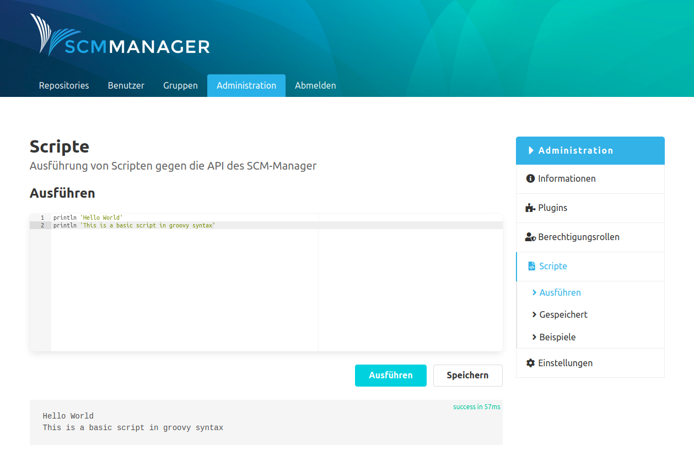

Das Script-Plugin erstellt einen Eintrag in der Navigation in der Administrations-Oberfläche der SCM-Manager Instanz. Auf dem ersten Unterpunkt im Bereich "Ausführen" können Scripte direkt eingetragen und auf der SCM-Manager Instanz ausgeführt werden. Nach dem Ausführen sieht man unten auf der Seite die Ausgaben und Ergebnisse des Scripts.

Es gibt die Möglichkeit eingetragene Scripte zu speichern. Dafür öffnet sich ein Speichern-Dialog in dem der Name und eine Beschreibung für das Script eingetragen werden.

