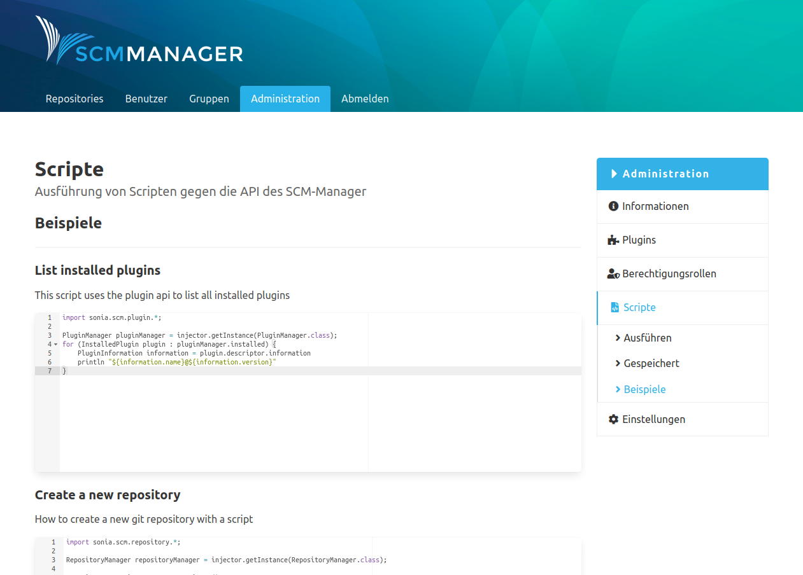

Es gibt vordefinierte Beispiele für Scripte. Über einen Injector können instanziierte Klassen der SCM-Manager Instanz im Script verwendet werden. Damit kann man direkt auf interne APIs des SCM-Managers zugreifen.

