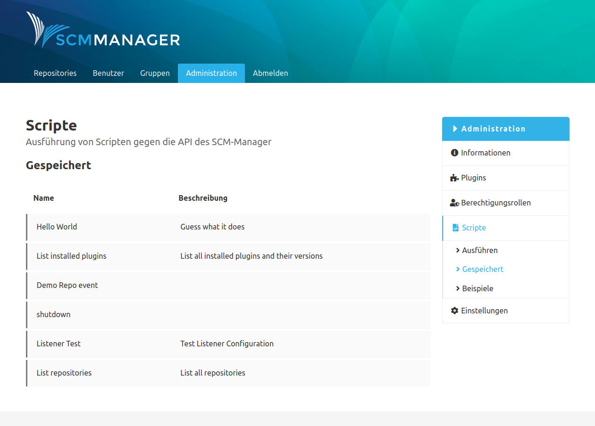
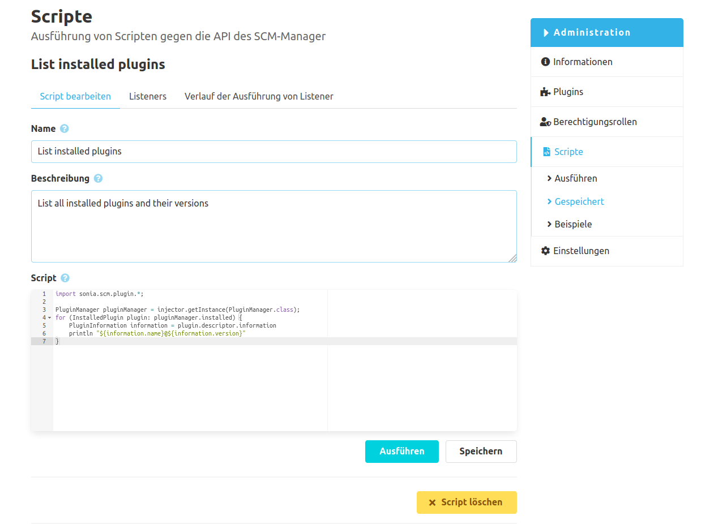
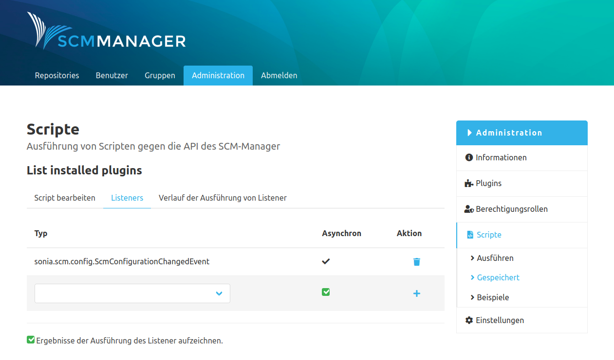
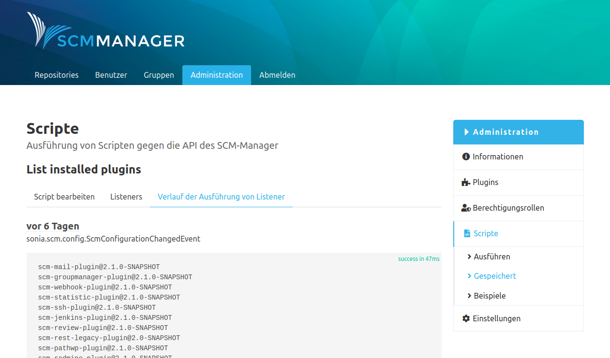

### Übersicht gespeicherte Skripte
Unter dem Navigations-Eintrag "Gespeichert" findet man eine Liste aller gespeicherten Skripte. Beim Klick auf einen Eintrag gelangt man in die Detail-Ansicht dieses Skripts.

### Skript Details
In der Detail-Ansicht gibt es über den editierbaren Feldern eine Navigation, um zwischen den Tabs für dieses Skript umzuschalten.

#### Skript bearbeiten
Hier können der Name, die Beschreibung und das Skript editiert werden. Das Skript kann auch wieder direkt ausgeführt werden oder man kann das Skript unwiderruflich löschen.

#### Listeners
Man kann einem gespeicherten Skript einen oder mehrere Listener anhängen. Damit wird dieses Skript jedes Mal ausgeführt, wenn ein Listener getriggert wird. Beim Hinzufügen eines Listeners kann entschieden werden, ob dieses Skript synchron oder asynchron ausgeführt werden soll.

Bricht das Skript bei der Ausführung als Listener mit einer Exception ab, so wird diese Exception weitergereicht.
Auf diese Weise können z. B. Commits verhindert werden, wenn das Skript synchron an das `sonia.scm.repository.PreReceiveRepositoryHookEvent` gebunden wird.

#### Listener Beispiel
Beispiel: Einem Skript, welches alle installierten Plugins auf der Konsole ausgeben soll, wird ein Listener für ein Event vom Typ "SCMConfigurationChangedEvent" hinzugefügt. Dieses Event wird vom SCM-Manager erzeugt, wenn die Konfiguration der SCM-Manager Instanz geändert wird. Über die entsprechende Checkbox können sämtliche Ausführungen dieses Skripts, die von Listener ausgelöst wurden, aufgezeichnet werden. 

Wenn man danach in den Einstellungen der SCM-Manager Instanz eine beliebige Konfiguration ändert, wird das entsprechende SCM-Event ausgelöst. Im Anschluss kann nun auf unterschiedlichen Wegen kontrolliert werden, ob das erstellte Skript tatsächlich ausgeführt wurde.

In dem entsprechenden Tab innerhalb der Skript-Details findet man eine Auflistung der Ausführungen des Skripts inklusive der Ergebnisse.

In den Server-Logs der SCM-Manager Instanz ist ebenfalls dokumentiert, dass das Skript ausgeführt wurde.

