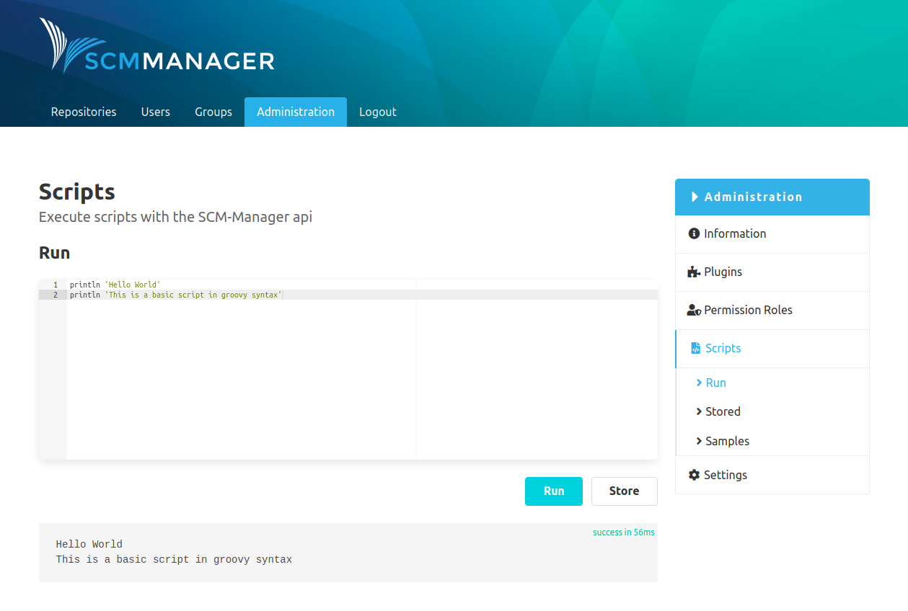
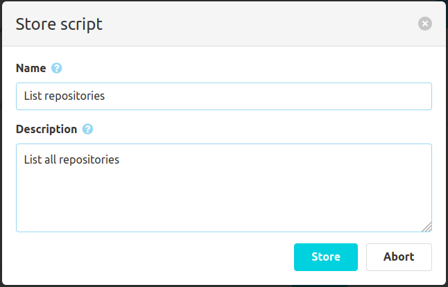

After the installation of the script plugin there is a "Scripts" entry in the navigation menu of the administration area of SCM-Manager. Under the first item "Execute", scripts can be executed directly. The results and outputs of the script are shown at the bottom of the page.

The "Store" button allows you to save scripts. It only requires a name and description.

