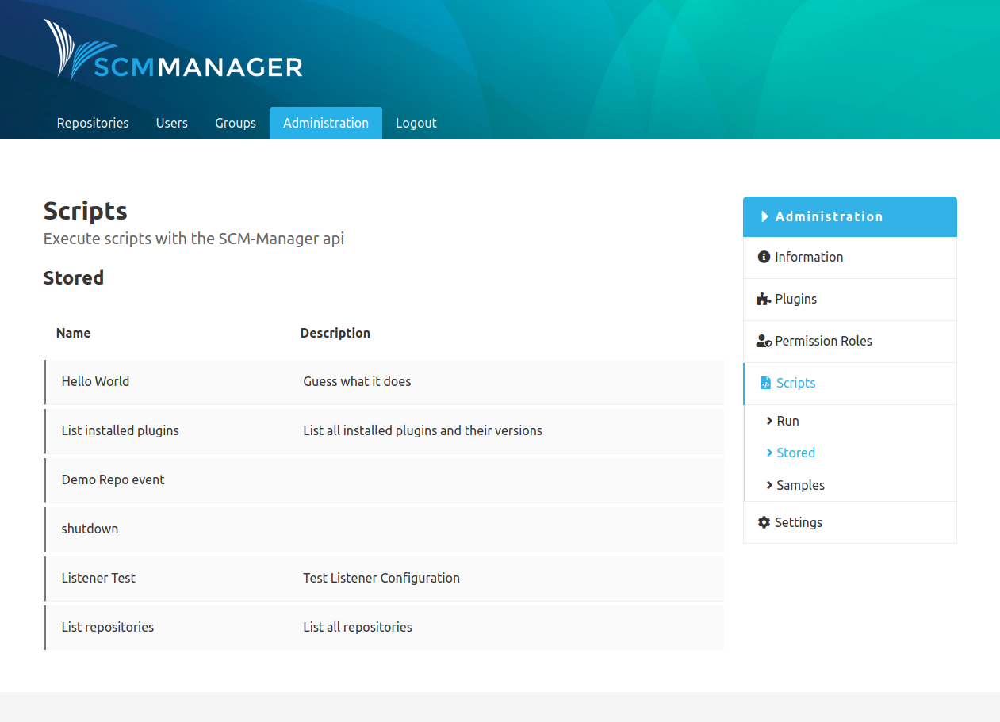
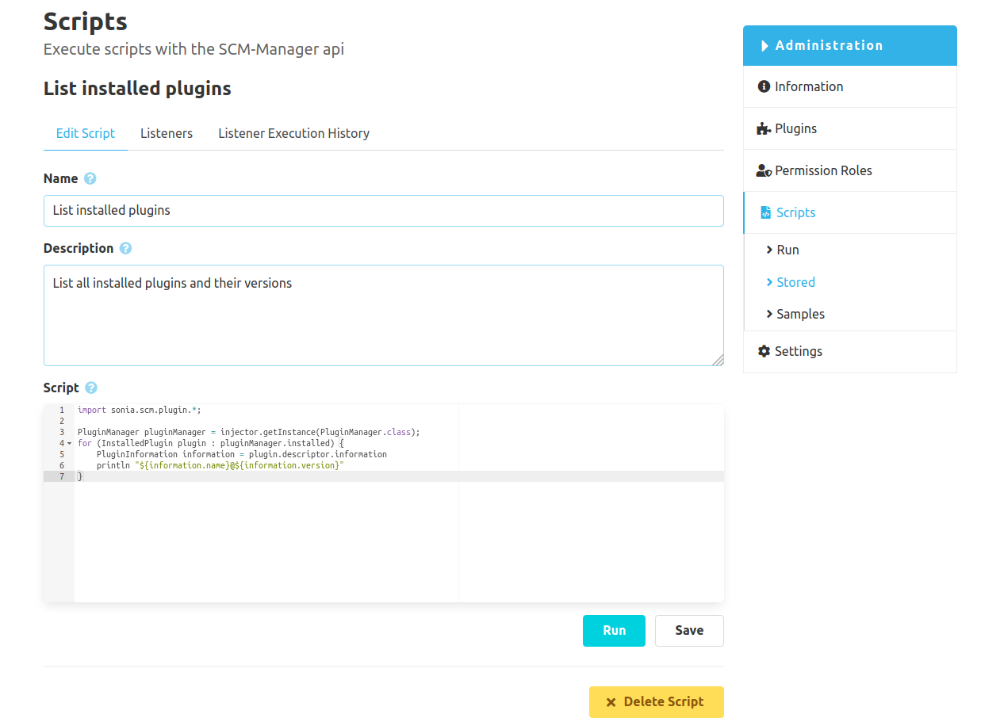
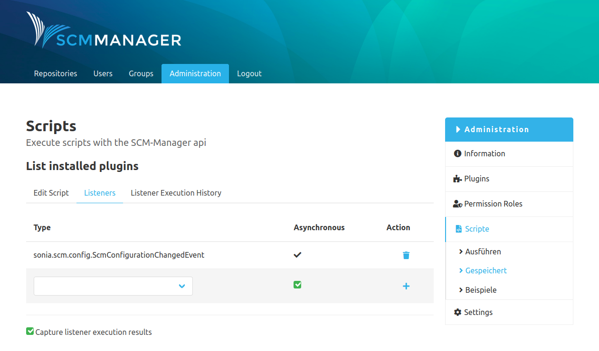
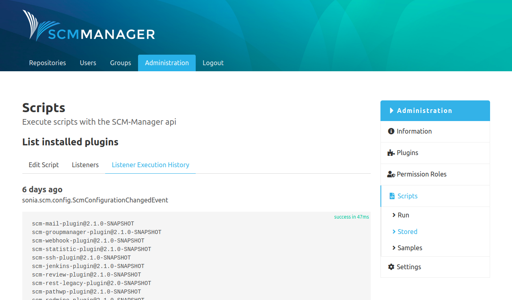

### Overview of stored scripts
The menu item "Stored" shows a list of all scripts that are stored. Clicking on an entry takes you to the detailed view.

### Script details
Above the editable fields "Name" and "Description" is a navigation bar with tabs for listeners and an execution history.

#### Edit script
Here, the name, description and the script itself can be edited. It is also possible to directly execute the script here or to irreversibly delete it.

#### Listeners
Listeners can be attached to a stored script. If that is done, the script is executed every time a listener is triggered. When adding a listener, it can be decided if the script will be executed synchronously or asynchronously.

#### Listener example
Example: A script that is supposed to list all installed plugins on the command line, gets a listener of the type "SCMConfigurationChangedEvent". This event is created by SCM-Manager when the configuration of the SCM-Manager instance changes. Through the corresponding checkbox all executions of the script, that were triggered by the listener, can be recorded.

If someone changes the settings of the SCM-Manager instance afterwards, the SCM-event is triggered. Afterwards, there are several ways to check if the script was executed.

The tab in the details of the script shows a list of all executions of the script including the results. 

Also, the server log of the SCM-Manager instance shows that the script was executed.

